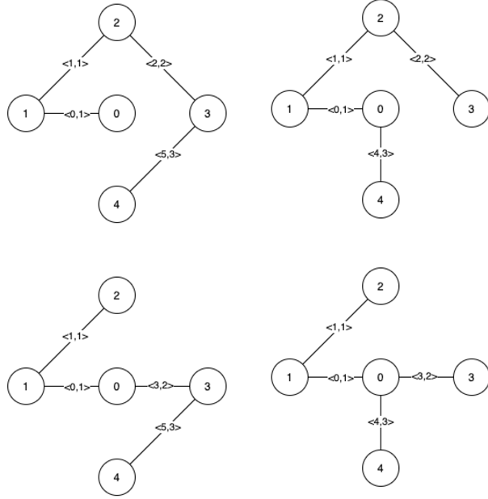

# [1489. Find Critical and Pseudo-Critical Edges in Minimum Spanning Tree](https://leetcode.com/problems/find-critical-and-pseudo-critical-edges-in-minimum-spanning-tree/description/) 

Given a weighted undirected connected graph with `n` vertices numbered from `0` to `n - 1`, and an array `edges` where each `edges[i] = [ai, bi, weighti]` represents a bidirectional and weighted edge between nodes `ai` and `bi`. 

A **Minimum Spanning Tree (MST)** is a subset of the graph's edges that connects all vertices without cycles and with the minimum possible total edge weight.

You are tasked to **find all the critical and pseudo-critical edges** in the given graph's MST.

- A **critical edge** is an edge whose deletion from the graph would cause the MST weight to increase.
- A **pseudo-critical edge** is an edge that can appear in some MSTs, but not in all of them.

### Note

- You can return the indices of the edges in any order.

## Example 1:

**Input:**  
`n = 5`,  
`edges = [[0,1,1], [1,2,1], [2,3,2], [0,3,2], [0,4,3], [3,4,3], [1,4,6]]`

**Output:**  
`[[0,1], [2,3,4,5]]`

**Explanation:**  
A figura acima descreve o grafo.  
A próxima figura mostra todas as possíveis MSTs:

Observe que as duas arestas `0` e `1` aparecem em todas as MSTs, portanto, elas são arestas críticas. Assim, retornamos essas arestas na primeira lista da saída.  
As arestas `2`, `3`, `4` e `5` fazem parte de algumas MSTs, mas não de todas. Portanto, elas são consideradas pseudo-críticas e as adicionamos à segunda lista da saída.

---

## Example 2:

**Input:**  
`n = 4`,  
`edges = [[0,1,1], [1,2,1], [2,3,1], [0,3,1]]`

**Output:**  
`[[], [0,1,2,3]]`

**Explanation:**  
Podemos observar que, como todas as 4 arestas têm o mesmo peso, escolher qualquer 3 arestas entre as 4 fornecidas resultará em uma MST. Portanto, todas as 4 arestas são pseudo-críticas.

---

## Constraints:

- `2 <= n <= 100`
- `1 <= edges.length <= min(200, n * (n - 1) / 2)`
- `edges[i].length == 3`
- `0 <= ai < bi < n`
- `1 <= weighti <= 1000`
- All pairs `(ai, bi)` are distinct.
