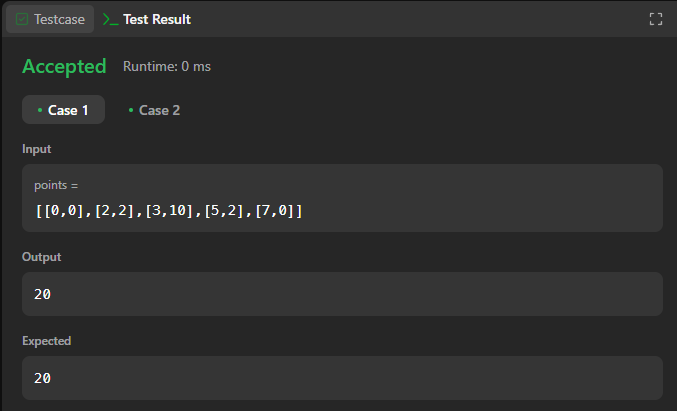
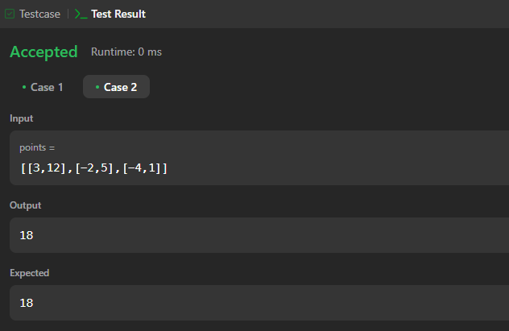
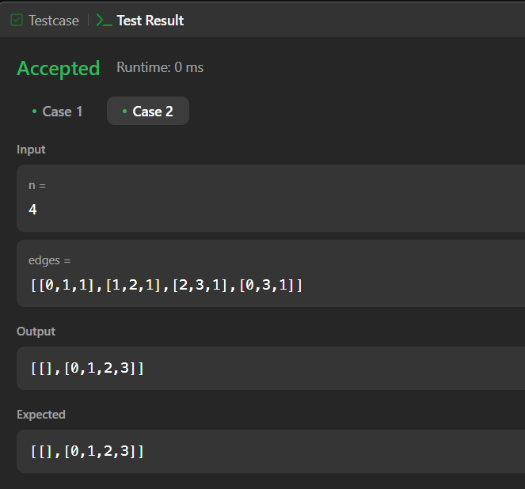
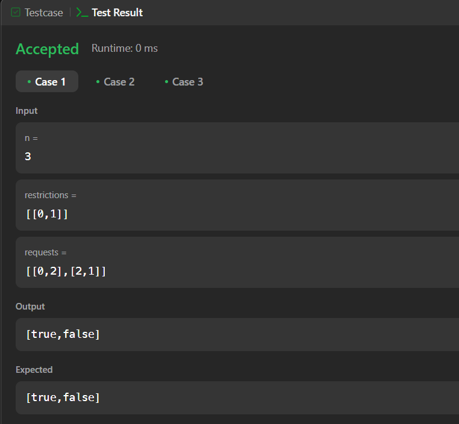
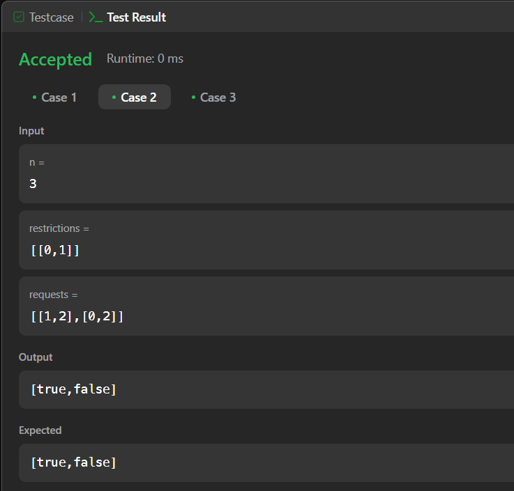
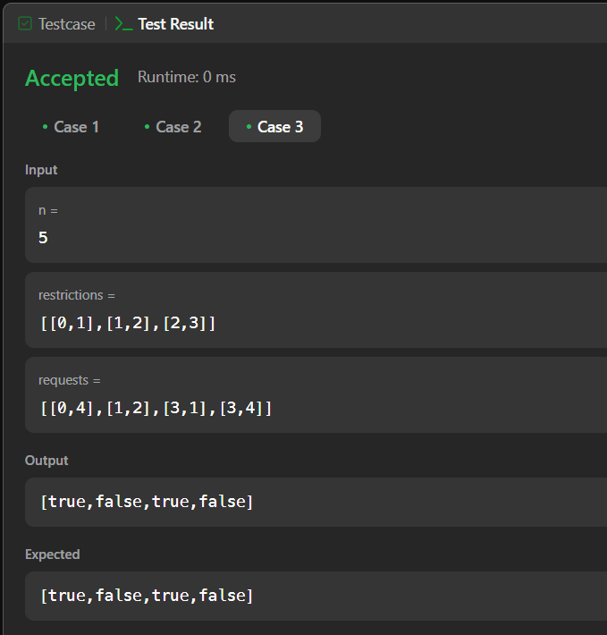

# Execícios do Leetcode

**Número da Lista**: 2<br>

**Conteúdo da Disciplina**: Grafos 2<br>

## Alunos

- Dupla 51

| Matrícula | Aluno                             |
| --------- | --------------------------------- |
| 190029692 | Igor Thiago Lima de Santana |
| 202017540 | Breno Soares Fernandes      |

## Sobre

Este projeto tem como objetivo resolver questões do [LeetCode](https://leetcode.com/problemset/?search=graph&page=1&sorting=W3t9XQ%3D%3D) sobre grafos utilizando a linguagem de programação Python. Abaixo, estão listadas as questões selecionadas, com seus respectivos níveis de dificuldade e vídeos explicativos da resolução.

## Questões

| Nome                                                                                                                                                  | Nível   |
| ----------------------------------------------------------------------------------------------------------------------------------------------------- | ------- |
| [1584. Min Cost to Connect All Points](https://leetcode.com/problems/min-cost-to-connect-all-points/description/?envType=problem-list-v2&envId=minimum-spanning-tree)  | Médio |
| # [1489. Find Critical and Pseudo-Critical Edges in Minimum Spanning Tree](https://leetcode.com/problems/find-critical-and-pseudo-critical-edges-in-minimum-spanning-tree/description/)  | Dificil |
|           # [2076. Process Restricted Friend Requests](https://leetcode.com/problems/process-restricted-friend-requests/description/)          | Dificil |

## Vídeo

 Aqui terá o vídeo[]()

## Screenshots

### [1584. Min Cost to Connect All Points](https://leetcode.com/problems/min-cost-to-connect-all-points/description/?envType=problem-list-v2&envId=minimum-spanning-tree)  

 **Caso 1:**




 **Caso 2:**



## Screenshots

### [1489. Find Critical and Pseudo-Critical Edges in Minimum Spanning Tree](https://leetcode.com/problems/find-critical-and-pseudo-critical-edges-in-minimum-spanning-tree/description/) 

 **Caso 1:**


 **Caso 2:**



## Screenshots

###  [2076. Process Restricted Friend Requests](https://leetcode.com/problems/process-restricted-friend-requests/description/) 

 **Caso 1:**




 **Caso 2:**



**Caso 3:**



## Video

[Vídeo]()


## Uso

Para executar as soluções, você pode colar o código diretamente no LeetCode ou criar casos de teste na função ```main``` do arquivo.


## Outros

Quaisquer outras informações sobre seu projeto podem ser descritas abaixo.